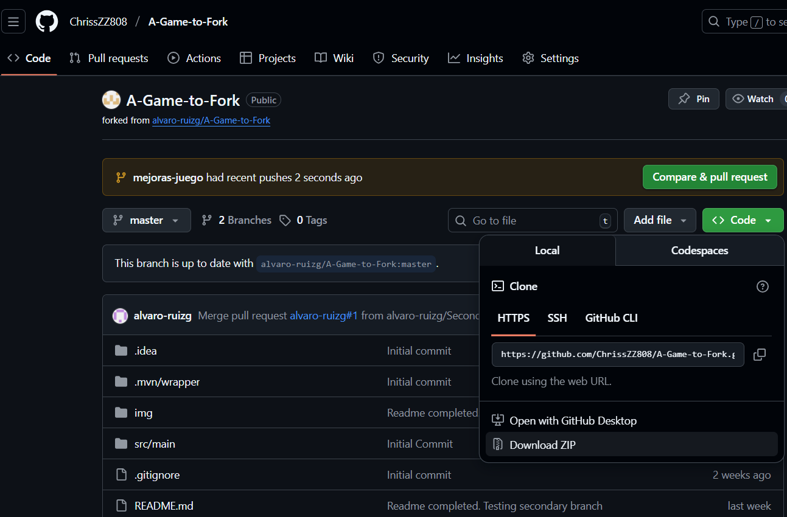
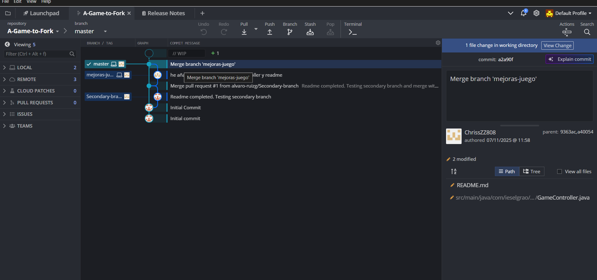
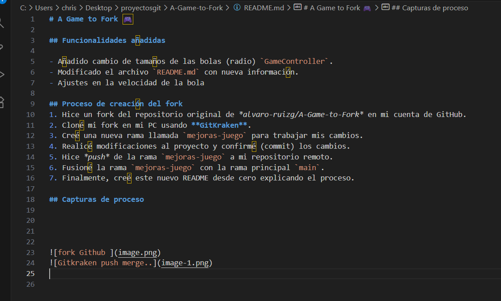
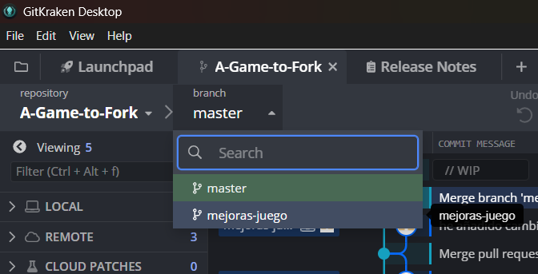

# A Game to Fork 🎮

## Funcionalidades añadidas

- Añadido cambio de tamaños de las bolas (radio) `GameController`.
- Modificado el archivo `README.md` con nueva información.
- Ajustes en la velocidad de la bola

## Proceso de creación del fork
1. Hice un fork del repositorio original de *alvaro-ruizg/A-Game-to-Fork* en mi cuenta de GitHub.
2. Cloné mi fork en mi PC usando **GitKraken**.
3. Creé una nueva rama llamada `mejoras-juego` para trabajar mis cambios.
4. Realicé modificaciones al proyecto y confirmé (commit) los cambios.
5. Hice *push* de la rama `mejoras-juego` a mi repositorio remoto.
6. Fusioné la rama `mejoras-juego` con la rama principal `main`.
7. Finalmente, creé este nuevo README desde cero explicando el proceso.

## Capturas de proceso

 

